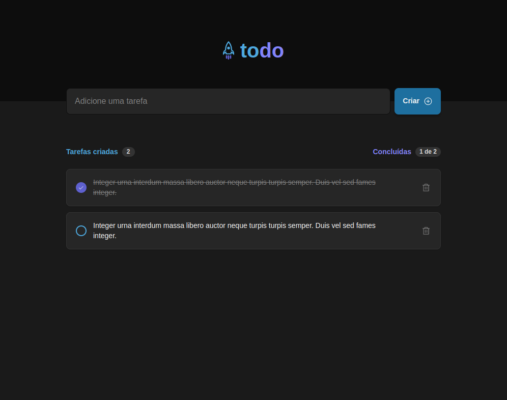

# Desafio - TodoApp - ignite

Desafio "Desafio 01 - Praticando os conceitos do ReactJS"
proposto pelo curso Ignite da RocketSeat, na trilha de React.JS

## Propósito

O propósito do desafio é implementar uma aplicação simples a partir de um protótipo, que contém
conceitos básicos/introdutórios de utilização do React.JS

## Além do proposto

Além do que foi proposto na tarefa, foi utilizado hooks para manter
os dados no local storage

## Demonstração

